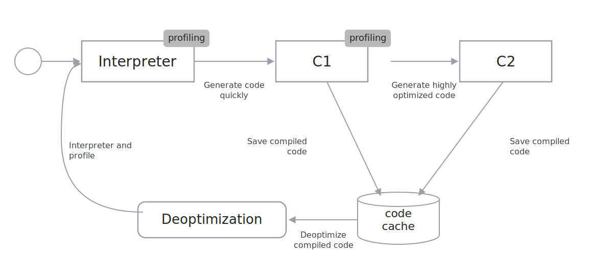
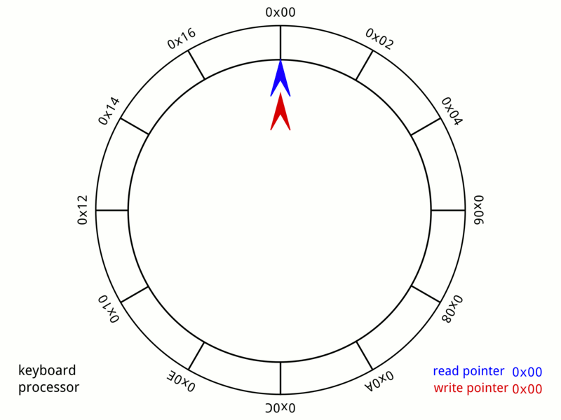

<!-- _class: lead -->
# Achieving Microsecond Latencies with Java
## How we built a 5M ops/sec exchange in pure Java

**Stefan Angelov** · Devoxx UK 2026

<!--
SPEAKER NOTES — Slide 1 (Title, 0:00):

Open by NOT introducing yourself. Open with the myth.
"Raise your hand if you've heard someone say Java can't do HFT."
Hands go up. Pause. Wait it out.

Then: "I've spent the last decade proving that wrong. In production.
Across a decade of fintech and gaming, now leading engineering at Tradu.
Five of those years on the matching-engine hot path. Real money on the line.
Today I'll show you how."

Don't say "agenda" yet. Hook first, plumbing later.

Total talk time: 50 min including ~5 min Q&A. Aim to land on Q&A by 0:45.
-->

---

<!-- _class: lead dark -->

## "Java is too slow for low latency."

# Five million ops per second.
# 0.5 µs median. p99 ≈ 42 µs.

**On a 2014 Xeon.**

<!--
SPEAKER NOTES — Slide 2 (The Hook, 0:30):

Numbers go up cold. Let them sink in.

Beats:
1. "5 million ops/sec" — pause.
2. "0.5 microsecond median" — pause longer. Half a microsecond.
3. "p99 forty-two microseconds" — let them check their assumptions.
4. "On a CPU from 2014. Probably costs less than my laptop."

Then: "This isn't a benchmark toy. This is exchange-core, open source on GitHub.
Three million users, ten million accounts, 100k symbols. Production code."

Don't apologise. Don't qualify. Just state it.

Goal: by minute 2, the room knows the talk is going to deliver real numbers
backed by real code, not vibes.
-->

---

<!-- _class: big-table -->

## How small is a microsecond?

| Unit     | What it is                  | Real-world analogue          |
|----------|-----------------------------|------------------------------|
| **1 ms** | one thousandth of a second  | a camera flash               |
| **1 µs** | one millionth of a second   | light travels ~300 m         |
| **1 ns** | one billionth of a second   | light travels ~30 cm         |

A network round-trip across a city: **~5 ms**. A single L1 cache read: **~1 ns**.
**Five orders of magnitude.** That's the playground we're standing on for the next 30 minutes.

<!--
SPEAKER NOTES — Timescales calibration (~0:45):

Quick calibration. 30 seconds max — don't dwell.

"Half a microsecond is half a millionth of a second. In half a microsecond,
light travels about 150 metres. In one nanosecond, light moves 30 centimetres —
roughly the length of your laptop. Every number on this deck lives in that
range."

Use this to set scale, then move on. The audience needs to FEEL the units,
not memorise them. Reference the 0.5 µs from the previous slide so the
calibration lands on the headline number.
-->

---

## Who needs this kind of latency?

- **Trading & exchanges** — order matching, market data, risk gates
- **Online gaming** — competitive PvP, server-authoritative simulation
- **Real-time bidding** — ad auctions resolved in 10 ms end-to-end
- **Vehicle autopilot & robotics** — sensor fusion, control loops
- **Telco & 5G core** — packet-level processing inside the SLA

> The techniques are identical across all of these. **The domain is just the budget.**

<!--
SPEAKER NOTES — Low-latency domains (~1:00):

Broadens the audience. 30 seconds — don't dwell.

"This talk is framed around trading because that's where I work and where
the numbers are public. But the techniques aren't trading-specific.
If you're writing a game server, an ad auction engine, a robotics
control loop — the playbook is identical. The latency budget is just
a different number."

This earns the attention of the half of the room who don't work in finance.
Don't list every domain — pick the two that match the room.
-->

---

## Who am I

- **Stefan Angelov** — Engineering Manager at **Tradu** · Software Architect
- **10+ years** across fintech & gaming — distributed systems, millions of transactions
- **5 years** on the trading-system hot path — matching, risk, market data
- Co-founder of **Hacker4e** — kids' coding academy (Scratch + web)
- Plovdiv, Bulgaria

**Why listen:** every number on these slides is either from production trading systems I've worked on, or from a JMH benchmark in [github.com/stefanangelov/devoxx-uk-2026-low-latency-java](#) — both are open. [VERIFY repo URL]

<!--
SPEAKER NOTES — Slide 3 (About me, 1:00):

Keep this SHORT — under 60 seconds.

Don't list every job. The audience cares about credibility, not your CV.
The credibility comes from:
1. Production system that does the numbers (5M ops/sec).
2. Open source proof — exchange-core.
3. Runnable benchmarks they can re-run.

If they care who you are, the LinkedIn QR is on the resources slide.

Move on quickly. The numbers are the star.
-->

---

## What this talk is (and isn't)

**Three promises:**

1. **Mechanism over recipe** — you'll leave knowing *why*, not just *what*
2. **Every claim runnable** — a JMH benchmark backs every number on every slide
3. **Production-validated** — exchange-core has been doing this for years

**Not on the menu:** Loom, Valhalla speculation, GraalVM native-image, microbenchmark gotchas. Other talks cover those. This one is about the hot path.

<!--
SPEAKER NOTES — Slide 4 (Promises, 1:30):

State the contract with the audience explicitly.

The "not on the menu" line is important. It says: I respect your time,
I'm not going to wander, here's what we will and won't cover.

Then: "Three techniques. Three production-proven techniques. We'll get to
each one with code, with benchmarks, with the why."
-->

---

<!-- _class: big-table -->

## The mental shift

| Good Java | Hardware-aware Java |
|-----------|---------------------|
| Immutable objects | Pooled, mutable, reused |
| Dependency injection | Direct calls, JIT-inlinable |
| Clean abstractions | Hot path is one method |
| `ConcurrentHashMap` | One thread owns the data |
| "GC is fine" | GC is the enemy |

> *"That conversation broke my brain. Everything I thought I knew about writing Java suddenly didn't matter."*

<!--
SPEAKER NOTES — Slide 5 (Mental shift, 2:00):

This is the philosophical anchor. Hold for a beat on each row.

The quote at the bottom is from the article — that first week in crypto,
sitting in a meeting hearing "10 GB/s of market data." Tell that story
in one sentence: "Years back I'm in a meeting and someone says we
need to process 10 gigabytes per second of market data, and I'm nodding
like that's normal. It's not normal."

The pivot: "Everything you learned in your enterprise job is correct,
for that domain. We're going somewhere else now."
-->

---

## Part 1 — The platform

# How the JVM actually runs your code

<!-- _class: lead -->

<!--
SPEAKER NOTES — Slide 6 (Section break, 2:30):

Brief section break. Don't dwell.
"Before we talk technique, we need to align on what the JVM is doing
under the hood. Because every technique we'll discuss exists to give
the JIT compiler what it wants."
-->

---

<!-- _class: big-table -->

## JIT 101 — three tiers, not one

| Invocations       | Tier          | What it does                          |
|-------------------|---------------|---------------------------------------|
| 0 → 1,500         | Interpreter   | Profile collection — slow but free    |
| 1,500 → 10,000    | **C1**        | Fast compile, basic optimisations     |
| 10,000+           | **C2**        | Aggressive, profile-driven native code |

After ~10K invocations of a hot method — which happens in **milliseconds** for trading loops — you're running native machine code optimised for *your exact workload*.

**Cold-start vs fully-warmed: 10–20× difference.** That's why HFT systems warm up before they trade.

<!--
SPEAKER NOTES — Slide 7 (JIT tiers, 3:00):

Most Java devs think the JVM is interpreted bytecode. That was true in 1995.
Today, the JIT is the entire game.

The 10x-20x cold-vs-warm number lands. Tell the war story:
"I once benchmarked a cold start, got 200 µs p50, panicked, spent two days
profiling. Then I added a warm-up phase. 0.8 µs. I'd been benchmarking
the interpreter."

This sets up the inlining slide which is where the real fun is.
-->

---

## The JIT compilation pipeline



<!--
SPEAKER NOTES — JIT pipeline (~3:30):

Walk the diagram left-to-right. Slowly.

"Bytecode goes into the interpreter. The interpreter is slow but it's
profiling — counting branches, recording types. After about 1500 calls,
C1 takes over: a quick, light compile. After 10K, C2 kicks in: the
aggressive optimiser. Both stash the result in the code cache.

Here's the part most engineers don't know: deoptimisation. If the profile
turns out wrong — a branch you said you'd never take suddenly fires, a
monomorphic call site goes polymorphic — the JIT throws away the compiled
code and drops you back into the interpreter. That's where your latency
cliffs come from."

Bridge: "So everything we do from here on out is about feeding the JIT
the most stable, predictable, inlinable code we can write."
-->

---

## What C2 actually does

The JIT knows things you can't:

- **Which branches you take** — 99.9% of the time. Optimises for *those*.
- **Which objects don't escape** — eliminates the allocation entirely (scalar replacement)
- **Which virtual calls are monomorphic** — devirtualises and inlines them
- **Which loops are hot** — unrolls, vectorises, hoists invariants

**Inlining is the mother of all optimisations.** Three method calls collapse into direct field access. 15–20 ns → 2–3 ns. **7–10× faster.**

<!--
SPEAKER NOTES — Slide 8 (JIT tricks, 3:45):

Inlining is the headline. The other three optimisations are bonuses,
but inlining is what makes the rest of this talk possible.

"When the JIT inlines your hot path, it copies the method body straight
into the caller. No stack frame, no argument passing, no return.
Three method calls become three lines of arithmetic. That's where 7-10x
comes from."

Now set up the trap: "But the JIT is fickle..."
-->

---

<!-- _class: big-code -->

## The cost of doing nothing

```java
// Looks innocent. Allocates a String on every call —
// even when FINE logging is OFF.
logger.fine("Welcome to JPrime with " + getNumberOfParticipants() + " participants");

// Same intent. Zero allocation when FINE is disabled.
if (logger.isLoggable(Level.FINE)) {
    logger.fine("Welcome to JPrime with {} participants", getNumberOfParticipants());
}
```

The first version concatenates the string and calls `getNumberOfParticipants()` **every time** — even when nobody is listening. The second short-circuits.

> One `if`. **Zero allocation in the common path.** The smallest possible example of "lazy beats eager" on the hot path — and the one almost every codebase gets wrong.

<!--
SPEAKER NOTES — logger antipattern (~4:15):

Quick one — 45 seconds. Some of the audience just wrote this code last week.

"Every Java engineer has written the top version. It looks fine. It IS
fine in a controller method that runs ten times a second. On a hot path
that runs ten million times a second, you've just allocated ten million
strings — and called getNumberOfParticipants ten million times — for
log messages that NOBODY READS because FINE is off in production.

The bottom version costs you one if-statement. Saves you everything."

Bridge to 35-byte trap: "That's a small example of accidental cost.
Now let me show you a much bigger one — and this time it's the JIT
that bites you."
-->

---

## The 35-byte trap

> *"I spent two days debugging why our order validation got 10× slower after I extracted a helper method."*

The default `MaxInlineSize` is **35 bytes of bytecode**. My "clean" refactor added **8 bytes** to the caller. Pushed it past 35. Killed inlining. **10× slower.**

I reverted the refactoring.

> Backed by `InliningThresholdBenchmark.java` — the same method, with and without 8 bytes added, run side by side.

<!--
SPEAKER NOTES — Slide 9 (35-byte trap — landing line, 4:30):

This is one of the core landing lines of the talk. Deliver it slow.

"Two days. Two days I spent profiling, pulling out async-profiler, JFR,
PrintInlining. The bottleneck was that I'd 'cleaned up' the code by
extracting a helper method. Eight bytes pushed me past 35. The JIT
silently stopped inlining. My 2 ns hot path became 20 ns."

Pause. Then: "I reverted the refactoring."

Get the laugh. This is the room realising clean code can be the enemy
on the hot path.

The benchmark on disk reproduces this exactly — refer to it by name.
-->

---

## `-XX:+PrintInlining` — what the JIT actually did

Run the diagnostic flag. Read the output. **Don't guess.**

```text
@ 12   com.tradu.OrderBook::match (28 bytes)        inline (hot)
@ 17   com.tradu.OrderBook::priceLevel (15 bytes)   inline (hot)
@ 32   com.tradu.OrderBook::matchSlow (180 bytes)   too big
@ 41   com.tradu.RiskGate::check (42 bytes)         callee is too large
@ 48   java.util.HashMap::get (28 bytes)            intrinsic
```

**Three messages to memorise:**
- `inline (hot)` — JIT did the work, you're flying
- `too big` — over `MaxInlineSize` (35 bytes default; `FreqInlineSize` 325 for hot)
- `callee is too large` — same trap, viewed from the caller side

> The verification loop for every "did my refactor break inlining?" question.

<!--
SPEAKER NOTES — PrintInlining (~4:45):

This is the tool that lets you stop guessing about the JIT.

"After the 35-byte incident I never refactored hot-path code without
running this flag. Add `-XX:+UnlockDiagnosticVMOptions -XX:+PrintInlining`
to your JVM options. The output tells you exactly what the JIT decided
about every call site."

Three lines to memorise:
- "inline (hot)" — the win.
- "too big" — your method's bytecode is over MaxInlineSize. 35 by default,
  325 for hot methods (FreqInlineSize).
- "callee is too large" — same problem from the caller's POV.

"Don't profile. Don't guess. Run this flag. Read the output. Done."

This earns credibility with the JIT-aware crowd. About 60 seconds.
-->

---

## Escape analysis — when allocation disappears

Inlining is the gate. Once a method inlines, the JIT asks: **does this object escape?**

```text
                  new Order(price, qty)
                           │
                           ▼
             ┌─────────────────────────────┐
             │  Returned, stored in field, │
       YES   │  or passed to a non-inlined │
       ┌─────┤  method?                    │
       │     └─────────────────────────────┘
       │                   │ NO
       ▼                   ▼
  Heap allocation    Scalar replacement —
  (normal cost)      fields → CPU registers,
                     object never exists
```

**Implication:** small, short-lived objects can cost zero — **if the calling chain inlines.** Break inlining (the 35-byte trap), the object becomes real again. Allocation returns.

> Backed by `EscapeAnalysisBenchmark.java`.

<!--
SPEAKER NOTES — Escape analysis (~5:00):

This is what people mean when they say "the JIT will optimise away your
allocation." It's true. Sometimes.

"The decision tree: if this object escapes the method — returned, stored
in a field, passed to something that doesn't inline — the JIT has to put
it on the heap. Normal allocation. Normal cost. But if the object is
purely local, only used inside this method, and the method inlined into
its caller — scalar replacement kicks in. The object's fields go directly
into CPU registers. The object never exists. Zero allocation."

Bridge: "This is why the 35-byte trap hurts so much. Break inlining and
you don't just lose method-call optimisation — you lose escape analysis
on every object inside the method. A formerly free object suddenly costs
you twenty nanoseconds."

About 90 seconds. Move on to the memory wall.
-->

---

## The memory wall

| Level    | Latency      | Cycles   | Size                |
|----------|--------------|----------|---------------------|
| Register | < 1 cycle    | 1        | a handful           |
| L1 cache | ~1 ns        | 3–4      | 32–64 KB / core     |
| L2 cache | ~3 ns        | ~10      | 256 KB – 1 MB / core|
| L3 cache | ~12 ns       | ~40      | 8–32 MB shared      |
| RAM      | ~80–100 ns   | hundreds | gigabytes           |
| Disk (NVMe) | ~100 µs   | millions | terabytes           |

Going from L1 to RAM is **100×** slower. Going from RAM to disk is **1,000×** slower again.
**The hot path lives in cache. Everything else is the slow path.**

<!--
SPEAKER NOTES — Slide 10 (Memory wall, 5:00):

This sets up everything that follows. Off-heap, pooling, sharding, affinity —
all of these techniques exist to keep the hot path in L1/L2 cache.

"If you remember nothing else from this talk, remember this: a cache miss
to RAM costs you a hundred nanoseconds. Your entire latency budget on a
trading system might be ten microseconds. That's a hundred cache misses,
total, end-to-end. Spend them wisely."

Now we transition into "GC is the enemy" because GC = unpredictable
cache invalidation.
-->

---

<!-- _class: memory-slide -->

## Java's memory model — heap, stack, and metaspace

<div class="memory-model">
  <div class="mem-region">
    <div class="mem-region-title">Heap <span style="font-weight:400;font-size:18px;opacity:0.6">(GC-paused)</span></div>
    <div class="mem-region-content">
      <div class="young-gen">
        <div class="mem-box">Eden</div>
        <div class="mem-box">Survi<br>vor</div>
        <div class="mem-box">Survi<br>vor</div>
        <span class="young-gen-label">Young Generation</span>
      </div>
      <div class="mem-box old-gen-box">Old<br>Generation</div>
    </div>
  </div>
  <div class="mem-region">
    <div class="mem-region-title">Non Heap <span style="font-weight:400;font-size:18px;opacity:0.6">(GC never pauses you)</span></div>
    <div class="mem-region-content">
      <div class="mem-box">Metadata</div>
      <div class="mem-box">Threads</div>
      <div class="mem-box">Code<br>Cache</div>
      <div class="mem-box">GC</div>
    </div>
  </div>
</div>

Every `new` lands in **Eden**. Every pause comes from cleaning Eden, Survivor, or Old Gen. The Non-Heap region — including the off-heap buffers we'll use in 5 minutes — is **invisible to the GC.**

<!--
SPEAKER NOTES — Memory model (~5:30):

This slide earns the next ten minutes of the talk.

"Every Java object you allocate lands in Eden. Eden fills, young GC
fires, surviving objects move to a Survivor space. Survive enough cycles,
you get tenured into Old Gen. Old Gen fills, full GC fires. THAT is where
your fifty-millisecond pause comes from.

Look at the bottom half. Metaspace, code cache, thread stacks, direct
buffers — the GC doesn't touch any of that. It can't. It doesn't know
how. So if we move our hot-path data into the bottom half of this picture —
into off-heap buffers — the GC literally cannot pause us to clean it up."

This is the conceptual setup for Truth #1. Every off-heap technique is
'move data from the top half of this picture to the bottom half.'
-->

---

<!-- _class: big-table -->

## Why GC kills latency

GC isn't slow on average. **GC is unpredictable.**

| Percentile | Pause       | Verdict                      |
|------------|-------------|------------------------------|
| **p50**    | 0.1 ms      | fine                         |
| **p90**    | 1 ms        | fine                         |
| **p99**    | 10 ms       | problem                      |
| **p99.9**  | 50–500 ms   | career-ending in trading     |

**One 50 ms pause = 5,000× your latency budget.** Backed by `GcImpactBenchmark.java`.

<!--
SPEAKER NOTES — Slide 11 (GC pause shape, 5:45):

Latency engineers don't talk in averages. We talk in percentiles.
The p99 and p99.9 are where careers go to die in this domain.

"Your average GC pause might be 2 milliseconds. Sounds great.
But the worst pause in any given hour might be 200 milliseconds.
That ONE pause is the moment Bitcoin moves 5%. That ONE pause is
when your stop-loss should have fired. That ONE pause is the trade
you lose."

The whole rest of the talk is now framed: we eliminate GC, we eliminate
contention, we eliminate allocation. We're chasing the tail.

That sets up the Three Truths.
-->

---

<!-- _class: big-table -->

## GC pause shapes — picking the collector

| Collector | Pause shape | Throughput cost | Heap sweet spot |
|-----------|-------------|-----------------|-----------------|
| **G1** *(default)* | 10–50 ms typical, 100 ms+ tail | 5–10% | 4 – 32 GB |
| **ZGC** | **< 1 ms** even at TB scale | 10–15% | 8 GB – 16 TB |
| **Shenandoah** | 1–5 ms soft real-time | 10–15% | 4 GB – 1 TB |
| **Generational ZGC** *(JDK 21+)* | **< 1 ms** + better throughput | 5–10% | 4 GB – 16 TB |

ZGC and Shenandoah are **concurrent** — they do the work alongside your application threads. Pay in CPU, not in pause time.

> **For a microsecond-class hot path: none of these are fast enough.** 1 ms is still 1000× your budget. Modern collectors make GC tolerable for sub-second SLAs. They don't make it free. **You still have to eliminate allocation.**

> Backed by `GcImpactBenchmark.java` — same workload across all four configurations.

<!--
SPEAKER NOTES — GC pause shapes (~6:15):

Spend a minute. The audience needs to internalise that "just use ZGC"
isn't the answer for a sub-microsecond hot path.

"G1 is the default. Fine for most things. Multi-millisecond pauses
typical, occasionally a hundred or more on a full collection.

ZGC is the modern answer for large heaps and pause-sensitive work.
Sub-millisecond pauses, even on terabyte heaps. Costs you ten to
fifteen percent throughput because the work has to happen somewhere —
it happens concurrently with your app, eating CPU.

Generational ZGC, new in JDK 21, gets the same pause shape with much
better throughput. If you're on JDK 21 or later, you should be running
this.

But here's the lesson of the slide — even ZGC's one-millisecond pause
is a thousand times your latency budget on a microsecond-class hot
path. Modern GCs make latency-sensitive web services tolerable. They
don't make a matching engine free. You still have to NOT ALLOCATE."

Bridge: "Which is exactly the next slide."
-->

---

<!-- _class: lead dark -->

# Three counter-intuitive truths

## that everyone in this room
## was taught the opposite of

<!--
SPEAKER NOTES — Slide 12 (Three Truths intro, 6:30):

This is the dramatic pivot into the heart of the talk. Lean into it.

"Everything I'm about to tell you contradicts what you were taught
in your first Java job. Everything. And yet, every one of these
techniques is in production at exchange-core, doing five million
ops a second."

Brief pause. Then go straight into Truth #1.
-->

---

<!-- _class: lead dark -->

# Truth #1
## Off-heap beats on-heap.

**The garbage collector is a helicopter parent.
If it doesn't know your memory exists,
it can't pause you to clean it up.**

<!--
SPEAKER NOTES — Slide 13 (Truth #1 lead, 7:00):

Land the helicopter parent metaphor — it's the article's voice.

"The GC wants to know where every byte is at all times. It tracks
every object, checks if you're still using it, moves things around
when you aren't looking. Very helpful for a web app. Absolutely
devastating when you need consistent microsecond latency.

If we move our memory off-heap — DirectByteBuffer, Unsafe, Chronicle
Bytes — the GC can't see it. It can't pause us to clean it up.
That memory is emancipated."

Get the laugh on "emancipated." Move on.
-->

---

<!-- _class: big-code -->

## Off-heap mechanism

```java
// Allocate ONCE at startup, off the JVM heap
ByteBuffer direct = ByteBuffer.allocateDirect(1024 * 1024);
UnsafeBuffer buffer = new UnsafeBuffer(direct);

// Hot path — read/write primitives, zero allocation
long orderId = buffer.getLong(offset);
double price = buffer.getDouble(offset + 8);
int quantity = buffer.getInt(offset + 16);
```

<!--
SPEAKER NOTES — Slide 14 (Off-heap code, 7:45):

Walk through the code. Don't read it line by line — point at it.

"This is what off-heap looks like. One ByteBuffer, allocated once at
startup. Every message after that is a primitive read at an offset.
No `new`. No object header. No GC bookkeeping."

The next slide lands the four reasons why this is so much faster.
-->

---

## Why off-heap wins

- **No allocation** in the hot path
- **No GC tracking** — the memory isn't on the heap
- **No object headers** — just the bytes you wrote
- **No copy** — same bytes the kernel handed you, parsed in place

<!--
SPEAKER NOTES — Slide 15 (Off-heap rationale, 8:00):

Walk the four bullets. One sentence each.

"No allocation — the JIT doesn't even emit an `invokestatic` for `new`.
No GC tracking — the GC's mark phase doesn't traverse this memory.
No object headers — sixteen bytes per object, gone. We're just bytes.
No copy — when the kernel hands us a packet, we parse it in place.
We don't deserialise it into a Java object. The bytes the network
delivered ARE the object."

This sets up the headline number on the next slide.
-->

---

## Off-heap vs on-heap — the number

<div class="big-number">15×</div>

**On-heap message processing:** ~150 ns / message, 3 allocations, GC every ~15 s
**Off-heap message processing:** ~10 ns / message, **0 allocations, 0 GC**

> Worst-case (during a young GC): on-heap = 50 ms. Off-heap = 20 ns. **2,500,000× tail-latency improvement.**

> Backed by `OnHeapVsOffHeapMessageBenchmark.java`. Run on the EPYC reference box.

<!--  -->

<!--
SPEAKER NOTES — Slide 15 (Off-heap chart/number, 8:30):

The "15x" goes up huge. That's the headline. The detail underneath
is for the front row.

"Fifteen times faster on average. But that's not the win. The win
is the tail. The on-heap version, when GC fires, is 50 milliseconds.
The off-heap version is 20 nanoseconds, ALWAYS.

Two and a half MILLION times better in the worst case.

That's not a number you optimise toward. That's a number you get
by elimination — by deleting the GC from the equation entirely."

If the chart isn't rendered yet, use the big-number layout. The
chart goes in the right column at present time.
-->

---

## When you'd actually do this

**Off-heap shines when:**
- Hot path processes messages from network or memory-mapped files
- You can pre-size buffers at startup (not in steady state)
- You can give up Java's safety net for raw byte addressing

**Off-heap is wrong when:**
- You're building a CRUD app at 50 req/s
- Your team can't audit `Unsafe` / `DirectByteBuffer` lifecycle bugs
- The hot path *isn't* the bottleneck

> Pick one approach and commit. **Mixing on-heap and off-heap in the same hot path is the worst of both worlds.**

<!--
SPEAKER NOTES — Slide 16 (When to use, 9:15):

Important — be the senior engineer in the room, not the evangelist.

"If you're building a REST API at 50 requests a second, ignore
everything I just said. You'll spend a month chasing native memory
leaks for no reason. These techniques cost real complexity.

The trade-off is only worth it when microseconds actually matter.
And the moment you decide to go off-heap, commit. Half off-heap is
worse than fully on-heap — you get the GC pauses AND the manual
memory management."
-->

---

<!-- _class: lead dark -->

# Truth #2
## Single-threaded beats multi-threaded.

**Locks don't scale.
Adding threads made our account service
**800× slower**.**

<!--
SPEAKER NOTES — Slide 17 (Truth #2 lead, 10:00):

This is the most counter-intuitive slide in the deck. The room will
push back internally — "no way, 800x is hyperbole."

"I'm not exaggerating. I ran the JMH benchmark four times because
I refused to believe it. Single-threaded: 0.5 nanoseconds.
Two threads with synchronized: 150 nanoseconds. Four threads:
400 nanoseconds. EIGHT hundred times slower than the single-threaded
version, just by adding threads."

Then drop the next slide on them.
-->

---

<!-- _class: big-code -->

## The shard-per-thread pattern

```java
// User 100 → shard 0.  User 101 → shard 1.  User 102 → shard 2.
// Each shard is a single thread. No locks. Ever.

public class ShardedAccountService {
    private final int shardId;
    private final long shardMask;
    private final Long2ObjectHashMap<Account> myAccounts;

    public void update(long userId, long delta) {
        if ((userId & shardMask) != shardId) return;
        myAccounts.get(userId).balance += delta;
    }
}
```

<!--
SPEAKER NOTES — Slide 18 (Sharding code, 10:45):

Walk through the routing logic. Bitwise AND for fast modulo.

"User 100 belongs to shard zero. Shard zero owns user 100. Forever.
Nobody else touches user 100's account. Ever. No locks needed
because there's no contention.

This sounds primitive. It IS primitive. It's also how exchange-core
does five million operations per second."

The next slide is the three reasons this is fast.
-->

---

## Why sharding wins

- **One thread owns each user.** Forever. No other thread can touch it.
- **No `synchronized`. No `ConcurrentHashMap`. No CAS.**
- **L1 cache stays warm** — the same thread always touches the same data.

<!--
SPEAKER NOTES — Slide 19 (Sharding rationale, 11:15):

Three bullets. One sentence each. Land them slowly.

"One thread owns each user. The Linux scheduler can't get cute.
The L1 cache that has user 100's account on it is the cache of the
core that is processing user 100. Always. Every microsecond.

No synchronized — because there's nothing to synchronise. No
ConcurrentHashMap — because there's no concurrent access. No CAS —
because there's no race. We didn't optimise the lock. We deleted it."

Move to the number.
-->

---

## Sharded vs contended — the number

<div class="big-number">100–1000×</div>

**3-thread contended `ConcurrentHashMap` + `synchronized` block:** 150–400 ns/op, p99 in the microseconds
**3-thread sharded via Disruptor + Agrona `Long2LongHashMap`:** 0.5–2 ns/op, **flat tail**

> Backed by `SingleThreadedShardVsContendedBenchmark.java`. 3 threads = 3 EPYC physical cores.

> Production proof: exchange-core's matching engine partitions by symbol — same pattern, same outcome.

<!--  -->

<!--
SPEAKER NOTES — Slide 19 (Sharding chart, 11:30):

Land the range — "100 to 1000x" — because the actual ratio depends on
how badly the contended version degrades, which depends on thread
count and cache topology.

"On three cores, with three threads contending, we measure between
100 and 1000 times slower for the locked version. The variance comes
from the cache coherence protocol — sometimes it cooperates,
sometimes it sets the cache on fire. The sharded version doesn't
have that variance. It just runs."

This is also where you preview the exchange-core mention — the
audience needs to know this isn't a benchmark trick.
-->

---

## Why locks are this expensive

It's not the lock. It's everything around the lock:

- **Cache-line ping-pong** — the lock word lives in one cache line. Every thread that touches it invalidates the others' copy.
- **Kernel transitions** — contended `synchronized` falls through to OS-level parking. Microsecond-class cost.
- **False sharing on adjacent fields** — two unrelated fields in the same 64-byte line bounce between cores.
- **Coherence traffic** — MESI protocol overhead grows quadratically with core count.

> Backed by `CasVsLockBenchmark.java` and `FalseSharingBenchmark.java`.

<!--
SPEAKER NOTES — Slide 20 (Why locks are slow, 12:15):

This is the mechanism slide for Truth #2. Spend a minute here —
the audience needs to internalise *why*, not just *that*.

"Adding `synchronized` doesn't just slow you down by the lock cost.
It activates an entire cascade of CPU-level effects. Cache lines
bounce between cores. The kernel gets involved. The MESI protocol
fires. None of this happens on the single-threaded path.

Sharding doesn't 'avoid the lock'. Sharding avoids the entire
cascade."

The two referenced benchmarks each illustrate ONE of these
mechanisms in isolation. Mention them by name so the audience
knows where to look.
-->

---

<!-- _class: lead dark -->

# Truth #3
## Pool beats allocate.

**"Allocation is cheap" — sure, until you do
**100,000 of them per second**.
That's 240 MB of garbage per minute.**

<!--
SPEAKER NOTES — Slide 21 (Truth #3 lead, 13:00):

This is the one most Java engineers are most uncomfortable with.
"Premature optimisation," they'll say.

"At a hundred thousand allocations a second, you're creating 240 MB
of garbage per minute. That garbage triggers young-gen GCs. Those
GCs pause your hot path. Pre-mature, my left foot — this is just
mature."

Get the laugh on "left foot" or your local equivalent. Move on.
-->

---

<!-- _class: ring-buffer-slide -->

## What's a ring buffer?

<div class="rb-grid">
  
  <p>A <strong>fixed-size array</strong> with a write cursor that wraps around. Old slots get overwritten by new writes — <strong>no allocation, no resize, no GC.</strong> The exact shape we want for a hot-path object pool.</p>
</div>

<!--
SPEAKER NOTES — Ring buffer concept (~13:30):

Spend 30 seconds here. The animation does the work.

"A ring buffer is the simplest possible data structure for fixed-throughput
producer-consumer. One array. One write cursor. When the cursor reaches the
end, it wraps around to the beginning and overwrites whatever was there.
No allocation. No copying. No GC."

Bridge: "Now the pool I'm about to show you is exactly this — except instead
of writing data, we're rotating through pre-allocated objects."
-->

---

## Ring-buffer object pool

```java
public final class RingBufferObjectPool<T> {
    private final T[] pool;
    private final long mask;
    private final AtomicLong cursor = new AtomicLong();

    public RingBufferObjectPool(Supplier<T> factory, int size) {
        if ((size & (size - 1)) != 0) throw new IllegalArgumentException();
        this.pool = (T[]) new Object[size];
        this.mask = size - 1;
        for (int i = 0; i < size; i++) pool[i] = factory.get(); // pre-allocate
    }

    public T acquire() {
        return pool[(int)(cursor.getAndIncrement() & mask)]; // bitwise modulo
    }
    // No release. Objects rotate. Whatever's at index N gets reused on cycle N+size.
}
```

- Pre-allocate at startup. Reuse circularly. **No release method.**
- Size **3–4× peak** — when Bitcoin moves 10%, your order rate triples.

<!--
SPEAKER NOTES — Slide 22 (Pool code, 13:45):

Three things to call out:
1. Power-of-two size — bitwise AND for fast modulo.
2. Pre-allocate in the constructor.
3. No release. The cursor moves forward, wraps around, and overwrites
   whatever was there. If your pool is sized big enough, the object
   you wrote N cycles ago is no longer in flight by the time you
   come back to it.

"This is the entire pool. About 15 lines. It's also the cleanest
example I've shipped to production."

The 3-4x peak sizing rule is a war story — tell it: "We sized for
average. First time the markets got volatile, we ran out of pooled
objects and the system stalled. Now we size for 3-4x peak. Costs
RAM. Saves your career."
-->

---

## Pooling vs allocation — the number

<div class="big-number">21×</div>

**Allocate-per-order:** 6 M allocations / minute, 240 MB garbage, ~20 young GCs
**Pooled (1024 objects):** 1024 allocations *total*, **0 MB garbage in steady state**

| Metric | Allocate | Pooled |
|--------|----------|--------|
| p50 latency | 45 µs | **8 µs** (5.6×) |
| p99 latency | 250 µs | **12 µs** (21×) |
| GC pauses (60 s window) | ~20 | **0** |

> Backed by `ObjectPoolingBenchmark.java`.

<!--
SPEAKER NOTES — Slide 23 (Pool chart, 14:30):

The 21x is the headline. The p50/p99 row is what really matters —
the tail is what wins.

"Five-and-a-half times faster on average. Twenty-one times faster
in the tail. Zero GC pauses in a sixty-second window. Compare that
to the allocate version: twenty pauses in the same window."

Set up the next slide — there's more nuance to pooling than
'just allocate up front'.
-->

---

## The pool's evil twins

**Canonical objects** — for *immutable* values, share the one true instance.
```java
private static final Boolean TRUE = Boolean.TRUE;   // never allocate true
private static final BigDecimal ZERO = BigDecimal.ZERO;
```

**Lazy initialisation** — for objects you might never need, allocate on first use, not in the constructor.

**Thread-locals** — per-thread instances of stateful, non-thread-safe objects (`SimpleDateFormat`, `NumberFormat`).

**Flyweight** — share intrinsic state across thousands of logical objects. Same idea, different name.

<!--
SPEAKER NOTES — Slide 24 (Pooling siblings, 15:15):

Quick fly-by. These are pooling's siblings — they all reduce
allocation pressure but in different ways.

"Pooling is the heavyweight. Canonical objects, lazy init, thread-locals,
flyweight — these are the lightweight cousins. You won't always need
a full pool. Sometimes a static `Boolean.TRUE` reference is the
entire optimisation."

Don't dwell. Move on. Audience needs to know these exist.
-->

---

## Part 2 — The libraries

# Don't reinvent these.

<!-- _class: lead -->

<!--
SPEAKER NOTES — Slide 25 (Libraries section break, 16:00):

Quick break. We've covered the three core techniques. Now we're going
to cover the four libraries that make those techniques liveable in
production.

"Off-heap, sharded, pooled — those are the techniques. But you don't
write them from scratch. You stand on the shoulders of four libraries.
Disruptor, Chronicle Queue, Chronicle Map, Agrona. Let's go through them."
-->

---

## LMAX Disruptor — the ring buffer that started it all

A bounded, **pre-allocated** ring buffer with **lock-free** producer/consumer coordination via `Sequence` and `SequenceBarrier`.

- **No allocation in steady state** — events are pre-allocated and overwritten
- **Mechanical sympathy** — padded sequences, cache-line aligned
- **Multi-producer, multi-consumer** with explicit dependency graphs
- **Wait strategies** — busy-spin, yield, block — pick your CPU/latency trade-off

> Used in the original LMAX exchange. Used in exchange-core. Used everywhere a `BlockingQueue` would have been used in 2010.

<!--
SPEAKER NOTES — Slide 26 (Disruptor mechanism, 16:30):

Disruptor is the conceptual centerpiece of low-latency Java. Even if
the audience never uses it directly, they need to understand the
shape of the problem it solves.

"BlockingQueue allocates a wrapper object per item, takes a lock per
operation, and produces unpredictable latency. The Disruptor preallocates
the events, uses a single atomic sequence counter for coordination,
and gives you sub-microsecond producer-consumer hand-off."

Don't go deep on sequence barriers — refer them to the docs.
The point is: it's a building block, you should know it exists.
-->

---

## Disruptor vs `ArrayBlockingQueue` — the number

<div class="big-number">5–15×</div>

**ArrayBlockingQueue** — locks under contention, allocates iterator on `take()`, pauses on capacity wait.
**Disruptor SPSC** — busy-spin, zero allocation, single-digit nanosecond hand-off.

> Backed by `DisruptorVsArrayBlockingQueueBenchmark.java`.

> **Caveat:** Disruptor's busy-spin wait strategy burns CPU. It's the right call when latency is the priority. It's the wrong call on a battery-powered device.

<!--  -->

<!--
SPEAKER NOTES — Slide 27 (Disruptor number, 17:15):

5-15x range — the spread depends on the wait strategy and contention level.

"Five to fifteen times lower latency. The exact number depends on the
wait strategy you pick. Busy-spin wins on latency, loses on power.
Yield is a compromise. Block is what you'd get with the standard library."
-->

---

## Chronicle Queue — persistent, microsecond IPC

```java
try (ChronicleQueue queue = ChronicleQueue.single("/tmp/queue");
     ExcerptAppender appender = queue.acquireAppender()) {
    appender.writeBytes(b -> b.writeLong(orderId).writeDouble(price));
}
```

- **Memory-mapped file** — between JVMs, between processes, even across reboots
- **Sub-µs append** for small messages (16–64 bytes)
- **Disk-backed** — you get durability essentially for free
- **No GC** — bytes go straight to the mapped region

> If you've ever been tempted to use Kafka for in-host process-to-process messaging — read about Chronicle Queue first.

<!--
SPEAKER NOTES — Slide 28 (Chronicle Queue, 18:00):

Chronicle Queue is the answer to "how do I get messages between two
JVMs on the same box without going through the kernel network stack?"

"Memory-mapped file. The kernel maps the same file into both processes'
address spaces. Writing to the queue is a memcpy into mapped memory.
Reading from the queue is a memcpy out. Sub-microsecond latency.
Persistent, because it's a file."

This is the kind of slide where someone in the audience goes
'wait, you can do that?' Yes, you can.
-->

---

## Chronicle Queue — the number

<div class="big-number">< 1 µs</div>

**Single-thread, single-queue:** 16-byte messages, **median ≈ 800 ns**. p99 ≈ 4 µs at the published numbers from Chronicle Software. [VERIFY against our run]
**Comparable Kafka producer (local broker):** **2–10 ms** end-to-end, several orders of magnitude higher.

> Backed by `ChronicleQueueBenchmark.java`. Output dir: `/tmp/devoxx-uk-bench-queue` (deleted in `@TearDown`).

<!--
SPEAKER NOTES — Slide 29 (Chronicle Queue number, 18:45):

The headline is "under one microsecond." That's the number that
shocks people coming from a Kafka background.

"Sub-microsecond inter-process messaging. Persistent. On disk.
Compare that to a local Kafka broker, which is in the millisecond
range. We're not in the same kind of system anymore."

The [VERIFY] tag is honest — we cite Chronicle's published numbers
until our own benchmark run validates the same on EPYC.
-->

---

## Chronicle Map — off-heap K/V at scale

```java
ChronicleMap<Long, Account> accounts = ChronicleMap
    .of(Long.class, Account.class)
    .name("accounts")
    .entries(10_000_000)
    .averageValueSize(128)
    .create();
```

- **Off-heap** — millions of entries with **zero GC pressure**
- **Memory-mapped** — survives JVM restart if you back it with a file
- **Concurrent reads, lock-striped writes** — designed for multi-threaded workloads
- **`ConcurrentHashMap` replacement** when entry count exceeds a few million

<!--
SPEAKER NOTES — Slide 30 (Chronicle Map, 19:30):

Chronicle Map is the off-heap answer to ConcurrentHashMap.

"At ten million entries, ConcurrentHashMap has the GC working overtime.
The mark phase has to traverse all those entries. Old generation fills.
You get ten-millisecond pauses just from existing.

Chronicle Map keeps the entire map off-heap. The GC never sees it.
Ten million entries, zero pause cost."
-->

---

## Chronicle Map vs `ConcurrentHashMap` — the number

<div class="big-number">~ 0 GC</div>

**ConcurrentHashMap @ 10M entries:** GC mark traverses all entries, full GCs of 100–500 ms become regular events.
**Chronicle Map @ 10M entries:** off-heap, **GC ignores it entirely**, lookup latency stays in tens of nanoseconds.

> Backed by `ChronicleMapVsConcurrentHashMapBenchmark.java`.

<!--  -->

<!--
SPEAKER NOTES — Slide 31 (Chronicle Map number, 20:15):

The headline isn't a speedup ratio — it's the elimination of GC pauses
on a multi-million-entry map. That's the whole point.

"Same lookup latency. The difference is the absence of GC. At ten
million entries, that absence is the entire optimisation."
-->

---

## Agrona — the foundation

The library you're already using if you've ever touched Disruptor or Aeron.

- **`Long2ObjectHashMap`, `Long2LongHashMap`** — primitive keys, no boxing, no `Long` cache pollution
- **`UnsafeBuffer`** — the off-heap buffer everyone else builds on
- **`OneToOneRingBuffer`** — Aeron's lock-free ring buffer, simpler than Disruptor for single producer / single consumer
- **`IdleStrategy`** — `BusySpin`, `Backoff`, `Yielding`, `Sleeping` — composable wait strategies

> If you remember one library name from this talk, **remember Agrona.**

<!--
SPEAKER NOTES — Slide 32 (Agrona, 21:00):

Agrona is the secret. Most engineers in the audience won't have heard
of it. The ones doing serious low-latency work all use it.

"This is the library that everyone in the low-latency Java world uses
and nobody talks about at conferences. Primitive collections, off-heap
buffers, ring buffers, idle strategies. Foundation library.

If you remember one name from this talk, remember Agrona."
-->

---

## Agrona — the numbers

<div class="big-number">3–6×</div>

**`HashMap<Long, Long>` (boxing!):** Long objects per put/get, allocates `Long` instances, terrible cache behaviour
**`Long2LongHashMap` (Agrona):** primitives, contiguous arrays, **3–6× faster, 0% boxing**

**Agrona ring buffer (SPSC) vs `ArrayBlockingQueue`:** **3–8× lower latency** at single-producer/single-consumer.

> Backed by `PrimitiveCollectionsBenchmark.java` and `AgronaRingBufferBenchmark.java`.

<!--
SPEAKER NOTES — Slide 33 (Agrona numbers, 21:45):

Two numbers on this slide. The boxing one is the surprising one for
the audience.

"`HashMap<Long, Long>` looks fine until you realise it boxes every
key and every value. Each `put` allocates a `Long`. The cache pollutes
itself. `Long2LongHashMap` is just two parallel `long[]` arrays.
Three to six times faster, zero boxing.

The ring buffer comparison is similar — same idea, lighter Disruptor."
-->

---

## Part 3 — Mechanical sympathy

# What the CPU actually wants from you

<!-- _class: lead -->

<!--
SPEAKER NOTES — Slide 34 (Mechanical sympathy section break, 22:30):

Brief section break. We've done techniques. We've done libraries.
Now we close with the CPU-level details that take you from "fast"
to "consistent."

"None of this matters if the CPU isn't on your side. Three things
the CPU rewards: laying out memory the way it wants it, taking the
branches it predicted, staying on the same core. That's mechanical
sympathy."
-->

---

## False sharing — the silent killer

Two unrelated `long` fields. Two threads. One cache line.
Each write invalidates the *other thread's* copy of the line. **Both threads stall.**

```java
class DataHolder {                  class DataHolder {
    public volatile long l1;            @Contended public volatile long l1;
    public volatile long l2;            @Contended public volatile long l2;
}                                   }
```

**Without `@Contended`:** the two longs share a cache line. Two threads writing to them ping-pong the line.
**With `@Contended`:** each long sits alone in its own 64-byte line. **3–8× faster.**

> Backed by `FalseSharingBenchmark.java`. Requires `-XX:-RestrictContended`.

<!--
SPEAKER NOTES — Slide 35 (False sharing, 23:15):

False sharing is the gotcha that nobody finds until they hit it.

"Two threads. Two completely unrelated longs. Same cache line.
Every time thread A writes l1, the cache coherence protocol marks
thread B's copy of the entire line invalid. Now thread B has to
re-fetch — even though l1 didn't matter to it.

`@Contended` adds 64 bytes of padding around the field. Each long
gets its own cache line. The ping-pong stops."

This is also the slide where you can mention `-XX:-RestrictContended`
because it's the kind of detail that buys credibility with the
audience that already knows.
-->

---

## Branch prediction — predictable beats random

```java
// Sorted input: branch is predictable. CPU pipeline stays full.
for (int v : sortedArray) if (v >= 128) sum += v;

// Same code, shuffled input: branch is random. Pipeline stalls on every miss.
for (int v : shuffledArray) if (v >= 128) sum += v;
```

**Same code. Same data. Same comparisons.** The sorted version is **2–5× faster** because the CPU's branch predictor has a pattern to lock onto.

**Lesson:** sort hot-path inputs when you can. Avoid data-dependent branches in tight loops. Pre-compute a sentinel value if it lets you delete an `if`.

> Backed by `BranchPredictionBenchmark.java`.

<!--
SPEAKER NOTES — Slide 36 (Branch prediction, 24:00):

The Stack Overflow classic. "Why is processing a sorted array faster
than processing an unsorted one?"

"Same comparisons. Same data. The only difference is the order. The
CPU has a branch predictor. If the branch is predictable — taken,
taken, taken, then not, not, not — it keeps the pipeline full. If
the branch is random, the predictor fails on every miss. Twenty-cycle
pipeline stall. Two to five times slower.

In the hot path: predictable branches matter. Sort your inputs when
you can."
-->

---

## Thread affinity — pin the thread to the core

```java
try (AffinityLock lock = AffinityLock.acquireCore()) {
    processOrdersForShard0();
}
```

Combined with **Linux `isolcpus=1-4`** in GRUB:

- Linux scheduler ignores cores 1–4 entirely
- L1/L2 caches stay hot — no migration
- p99 spikes from scheduler migration **disappear**

> **Linux only.** On macOS the affinity calls are no-ops; the benchmark `@Setup` skips itself with `Assume.assumeTrue(...)`.

> Backed by `ThreadAffinityBenchmark.java`.

<!--
SPEAKER NOTES — Slide 37 (Affinity, 24:45):

Tell the war story.

"After we shipped sharding, we still had random p99 spikes. Not GC,
not contention, just unexplained 50-microsecond blips. Took me a
week to figure out it was the Linux scheduler migrating our threads
between cores. Every migration nukes L1 and L2 cache. Cache miss to
RAM is 100 nanoseconds. Dozens of them per migration.

Two-step fix: isolcpus in the bootloader to tell Linux to stay off
those cores, then OpenHFT Affinity to pin our threads. Spikes vanished."

Land the macOS caveat — half the audience is on a Mac. The benchmark
self-skips. They can run everything else.
-->

---

## A few more things you should know exist

- **Escape analysis** can eliminate allocations entirely — `EscapeAnalysisBenchmark.java`
- **Lock-free CAS** beats `synchronized` under contention by 2–10× — `CasVsLockBenchmark.java`
- **Inlining threshold** is the silent reason your "clean" code regressed — `InliningThresholdBenchmark.java`
- **GC choice matters** — G1 vs ZGC vs Shenandoah have different pause shapes — `GcImpactBenchmark.java`

> 15 benchmarks in the suite, every one mapped to a slide claim. The repo is the appendix.

<!--
SPEAKER NOTES — Slide 38 (Other benchmarks pointer, 25:30):

We're at the 25-minute mark now. We have ~20 minutes plus Q&A.
Use this slide to acknowledge the other benchmarks that didn't get
their own dedicated slide, but are in the repo and back individual
talking points throughout the deck.

"There are fifteen benchmarks in the repo. Four of them got their
own slide today. The other eleven back specific claims I made in
passing — escape analysis, CAS, inlining threshold, GC pause shape.
If you want to dig into any of them, the repo is the appendix to
this talk."
-->

---

## Part 4 — Putting it together

# What does a sub-10 µs system actually look like?

<!-- _class: lead -->

<!--
SPEAKER NOTES — Slide 39 (Putting it together break, 26:00):

Brief break. We're heading into the closing arc.

"You've seen the techniques in isolation. Let's put them together
and see what a complete sub-10-microsecond pipeline looks like."
-->

---

## Production architecture — exchange-core style

```
                  Client orders (WebSocket / FIX / REST)
                                 │
                                 ▼
                  ┌──────────────────────────────┐
                  │   LMAX Disruptor ring buffer │  off-heap, 1M pooled events
                  │   (multi-producer, lock-free)│  ◄── Truth #1 + #3
                  └──────────────────────────────┘
                                 │
                  ┌──────┬───────┼───────┬──────┐
                  ▼      ▼       ▼       ▼      ▼
                Shard 0  Shard 1  Shard 2  Shard 3
                Thread 0  Thread 1  Thread 2  Thread 3       ◄── Truth #2
                CPU 0     CPU 1     CPU 2     CPU 3          (isolcpus + affinity)
                  │       │         │         │
                  └───────┴────┬────┴─────────┘
                               ▼
                       Chronicle Queue (audit, replication)   ◄── persistence
```

Each thread is **pinned to an isolated core**. L1/L2 stays hot. No locks. No allocations in steady state. No GC pauses.

<!--
SPEAKER NOTES — Slide 40 (Architecture diagram, 26:30):

Walk the diagram top-to-bottom. Slowly. This is the moment everything
clicks for the audience.

"Orders come in over the wire. They land in a Disruptor ring buffer —
that's truth one and three: off-heap, pre-allocated, no allocation in
steady state. The Disruptor multiplexes them out to four shards.

Each shard is a single thread. That's truth two: no locks, no
contention, exclusive ownership of its slice of users.

Each thread is pinned to an isolated CPU core. The Linux scheduler
isn't allowed near those cores. The cache stays hot.

Outbound, audit and replication go to a Chronicle Queue — persistent,
sub-microsecond, off-heap.

Five million ops per second. Half a microsecond median. Zero GC.
On a 2014 Xeon."

This is the climax. Hold for a beat.
-->

---

## Why all three techniques. None alone are enough.

| Without... | What kills you |
|------------|----------------|
| Off-heap | GC mark/sweep on the message buffer = unpredictable pauses |
| Sharding | Lock contention = cache-line ping-pong + kernel parking |
| Pooling | Allocation in hot path = young-gen fills = GC pause every 10 s |

**They're multiplicative.** Each technique eliminates a different source of latency. **Skip one, and the other two can't save you.**

<!--
SPEAKER NOTES — Slide 41 (Why all three, 27:30):

The "they're multiplicative" line is the argument.

"You don't get to pick one. Off-heap alone leaves you with locks.
Sharding alone leaves you with allocations. Pooling alone leaves
you with GC tracking the buffer. Each technique deletes a specific
source of latency. You need all three because the three sources
are independent."
-->

---

## Production proof — exchange-core

**[github.com/exchange-core/exchange-core](https://github.com/exchange-core/exchange-core)** — open source

- 3M users, 10M accounts, 100K trading symbols
- Off-heap ring buffer, sharded matching engine, pooled events
- **5M ops/sec, 0.5 µs median, p99 ≈ 42 µs** on a 2014 Xeon
- Apache 2.0. Read it. Run it. Steal from it.

> *"Every technique in this talk is in that codebase. If you remember nothing else, remember the URL."*

<!--
SPEAKER NOTES — Slide 42 (exchange-core URL, 28:15):

This is where you tell the audience to actually go look.

"Apache 2.0 licensed. Every technique I just showed you is in that
codebase, written by people who do this professionally. Read it.
Run it. Steal from it.

When I joined my first crypto company, I read this codebase for
two weeks before I wrote a line of production code. It's the best
example of these patterns I've seen, anywhere."
-->

---

## What you do Monday morning

1. **Measure first.** Turn on `-Xlog:gc*:file=gc.log`. Run async-profiler. Stare at p99, not average.
2. **Find your biggest leak.** Allocation-driven GC pauses? Pool the hot path. Lock contention? Shard. CPU underutilised at high load? Lock contention is hiding.
3. **Apply ONE technique. Measure again.** Don't apply all three at once — you won't know what helped.
4. **Test at 3× peak load.** Markets get volatile. Your pool needs to be sized for that.
5. **Warm up before you go live.** A million synthetic ops triggers C2. Don't measure interpreter latency.

> *"Don't do what I did. Don't spend a week optimising the wrong thing."*

<!--
SPEAKER NOTES — Slide 43 (Monday morning, 29:00):

This is the actionable takeaway. The audience leaves with a checklist
they can run on Monday.

"Five things, in order. Measure first. Always. Then find your biggest
leak. Then apply ONE technique — not all three. Then re-measure.
Test at three times peak. Warm up.

The story I want to tell on this slide is mine: I once spent a week
optimising Protobuf serialisation because it 'felt' like the bottleneck.
Latency improved 5%. Then I actually profiled, and the bottleneck was
ONE LINE — a synchronized block on a ConcurrentHashMap. The whole
serialisation week was wasted because I didn't measure first."

Get the laugh on the war story. Move to resources.
-->

---

## Resources

**Code & benchmarks:**
- This talk's repo: [github.com/stefanangelov/devoxx-uk-2026-low-latency-java](#) [VERIFY]
- exchange-core: [github.com/exchange-core/exchange-core](https://github.com/exchange-core/exchange-core)
- Agrona: [github.com/real-logic/agrona](https://github.com/real-logic/agrona)
- LMAX Disruptor: [lmax-exchange.github.io/disruptor](https://lmax-exchange.github.io/disruptor)
- Chronicle Queue / Map: [chronicle.software](https://chronicle.software)
- OpenHFT Affinity: [github.com/OpenHFT/Java-Thread-Affinity](https://github.com/OpenHFT/Java-Thread-Affinity)

**Reading:**
- *Java Performance, 2nd ed.* — Scott Oaks (O'Reilly)
- *Mechanical Sympathy* blog — Martin Thompson
- The JavaPro Special Edition piece this talk is based on [VERIFY URL]

<!--
SPEAKER NOTES — Slide 44 (Resources, 29:45):

Don't read the URLs aloud. The slides will go up. The repo will go up.
Just point at the categories.

"Code, benchmarks, libraries up top. Reading material at the bottom.
Scott Oaks's book is the canonical Java perf reference. Martin
Thompson's blog is the mechanical sympathy gospel.

Slides will be on my GitHub by tonight."
-->

---

<!-- _class: lead -->

# Thank you.

## Questions?

**Stefan Angelov** · [linkedin.com/in/stefanangelov](#) · [github.com/stefanangelov](#) [VERIFY both URLs]

> *"The language isn't the limitation. Your understanding of the platform is."*

<!--
SPEAKER NOTES — Slide 45 (Q&A, 30:00):

Hard stop on content at 30 minutes. Twenty minutes for Q&A —
that's generous and intentional.

The closing line is from the article. Land it. Then open Q&A.

If no questions in the first 10 seconds, prompt with one of these:
- "Most common pushback I get on this is 'but Loom solves all this'.
  Want me to take that one head-on?"
- "Anyone here running a system that needs sub-millisecond latency
  but isn't trading? I'd love to hear what domains people are bringing
  these techniques to."
- "How many people in the room have heard of Agrona before today?
  [count] OK, that's the gap I came here to close."

Always end with the LinkedIn QR or URL. People who liked the talk
will reach out.
-->
